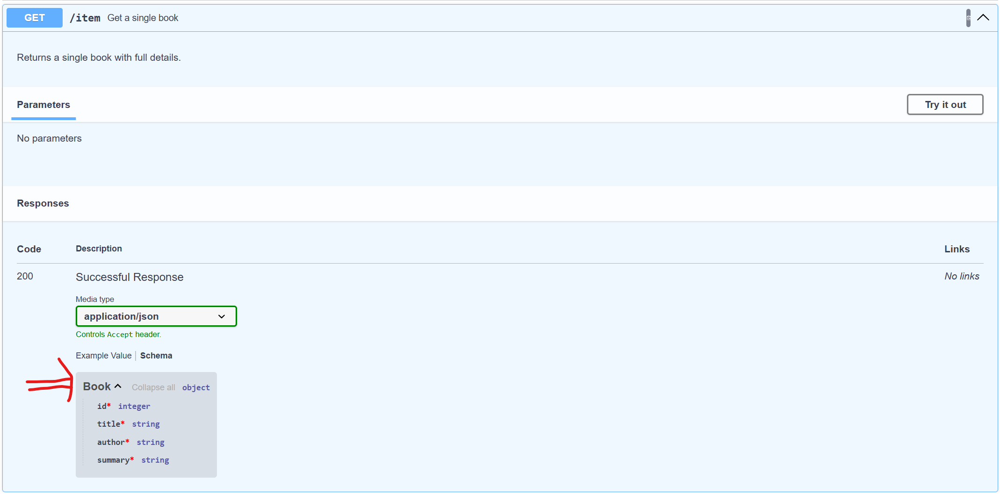
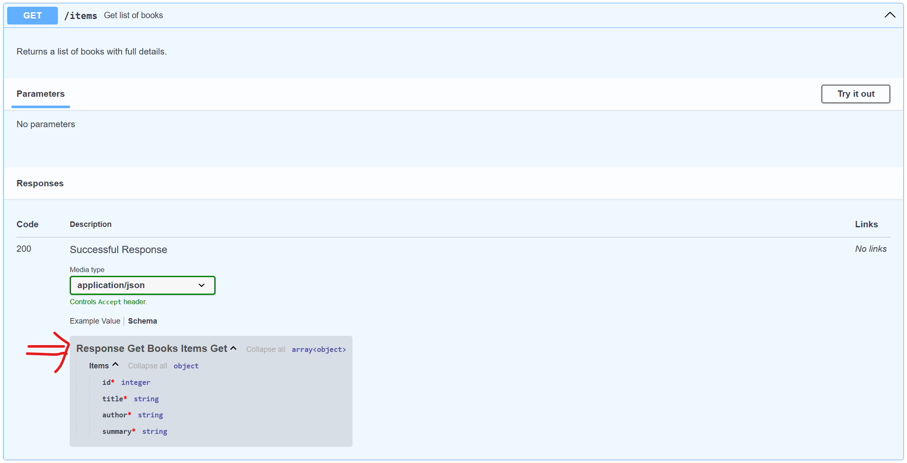

# fastapi-swagger-ui-issue
A minimal FastAPI project demonstrating two endpoints:
- One returning a single book with full details.
- One returning a list of books with full details (illustrating the inline schema naming issue in Swagger UI when using a list).

## Endpoints

- **GET /item**  
  Returns a single `Book` with full details.

- **GET /items**  
  Returns a list of `Book` objects with full details.

## How to Run

1. Setup a virtual environment
   ```bash
   python3 -m venv venv
   source venv/bin/activate
   ```

2. Install dependencies:
   ```bash
   pip install -r requirements.txt
   ```

3. Run the app:
   ```bash
   python3 main.py
   ```

4. Open http://127.0.0.1:8000/docs to view the Swagger UI.

## Problem
In the first image, we can see the _schema_ has been set to: _Book_.

In the second image, we can see the _schema_ has been set to: _Response Get Books Items Get_.

### Using _-> Book:_ annotation


### Using _-> List[Book]:_ annotation

